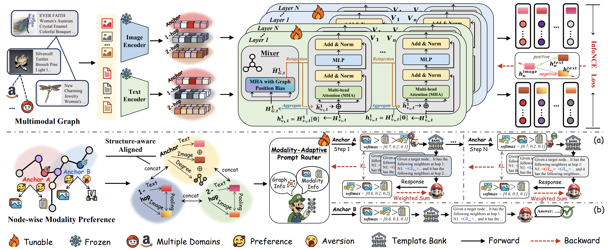

<p align="center">
  
</p>

<h1 align="center">
  Mario: Multimodal Graph Reasoning <br>
  with Large Language Models
</h1>

<p align="center">
  <a href="https://arxiv.org/pdf/2603.05181">
    
  </a>
  <a href="https://huggingface.co/datasets/Sherirto/MAGB">
    
  </a>
</p>

<p align="center">
  <a href="#overview">Overview</a> •
  <a href="#installation">Installation</a> •
  <a href="#configuration">Configuration</a> •
  <a href="#data-construction">Data Construction</a> •
  <a href="#training-scripts">Training Scripts</a> •
  <a href="#evaluation">Evaluation</a> •
  <a href="#citation">Citation</a> •
  <a href="#acknowledgments">Acknowledgments</a> •
  <a href="#license">License</a>
</p>

<p align="center">
  
</p>

## Overview

Mario is a unified two-stage framework for relational text-vision data on multimodal graphs, where nodes contain both text and image information and edges provide structural context.

Mario addresses two key challenges: weak cross-modal consistency and heterogeneous modality preference. It first performs graph-conditioned image-text alignment under graph topology, then uses modality-adaptive graph instruction tuning with a learnable router to select the most informative modality view for each node and its neighborhood.

Across diverse multimodal graph benchmarks, Mario achieves state-of-the-art performance and delivers substantial gains in zero-shot transfer, taking a step toward LLM reasoning over structured multimodal worlds.

## Installation

Install dependencies from the repository root:

```bash
pip install -r requirements.txt
```

The current release uses:

```text
torch>=2.1
dgl>=1.1
numpy>=1.24
pandas>=2.0
scikit-learn>=1.3
tqdm>=4.66
transformers>=4.44
peft>=0.12
```

For distributed Stage 2 training, run the training entry point with `torchrun`.

## Configuration

The repository is organized as follows:

```text
Mario_CVPR2026_final_release/
├── LICENSE
├── README.md
├── cover.png
├── logo.png
├── requirements.txt
├── scripts/
│   ├── train_movies_paper_ddp.sh
│   └── train_movies_stage2_ddp.sh
├── stage1/
│   ├── main.py
│   ├── dataset_amazon_small.py
│   ├── dataset_amazon_large.py
│   ├── models.py
│   ├── config.json
│   ├── configs/
│   └── src/
└── stage2/
    ├── train_llm.py
    └── mario_llm_stage2/
```

The release contains two main stages:

- `stage1/`: multimodal encoder training and node embedding export.
- `stage2/`: modality-adaptive LLM tuning, routing, validation, and final evaluation.

The one-command Movies pipeline is configured through environment variables:

| Variable | Required | Default | Description |
| --- | --- | --- | --- |
| `LLM_MODEL_PATH` | Yes | - | Local path to the LLM checkpoint. |
| `DATA_ROOT` | No | `../data/MAGB` | Root directory containing the dataset folder. |
| `GPUS` | No | `0,1,2,3` | Comma-separated GPU IDs used by Stage 2. |
| `STAGE2_RESUME` | No | empty | Optional Stage 2 checkpoint path for resuming. |

Stage 2 also supports the following inference policies:

- `router`
- `text`
- `image`
- `mm`
- `vote3`

## Data Construction

Datasets and model checkpoints are not included in this repository. Keep datasets and local LLM checkpoints outside the code repository, then pass their paths through environment variables or command-line arguments.

For example, if using the Movies dataset for the experiment, the expected data layout is:

```text
<DATA_ROOT>/
└── Movies/
    ├── Movies.csv
    ├── MoviesGraph.pt
    ├── ImageFeature/
    │   └── Movies_Llama-3.2-11B-Vision-Instruct_visual.npy (example)
    └── TextFeature/
        └── Movies_Llama_3.2_11B_Vision_Instruct_512_mean.npy (example)
```

`Movies.csv` and `MoviesGraph.pt` are required by Stage 2. The `ImageFeature/` and `TextFeature/` files are used by Stage 1 when `--use_large_features` is enabled.

## Training Scripts

### One-command pipeline

Run the full Movies pipeline with:

```bash
LLM_MODEL_PATH=/path/to/Llama-3.1-8B-Instruct \
DATA_ROOT=/path/to/data/MAGB \
GPUS=0,1,2,3 \
bash scripts/train_movies_stage2_ddp.sh
```

This script runs:

1. Stage 1 feature generation from `stage1/main.py`.
2. Stage 2 distributed LLM tuning from `stage2/train_llm.py`.

### Stage 1: feature generation

Stage 1 trains the multimodal encoder and exports node embeddings for Stage 2.

```bash
cd stage1

DATA_ROOT=/path/to/data/MAGB python main.py \
  --dataset Movies \
  --use_large_features \
  --n_epochs 80 \
  --lr 0.001 \
  --lr_scheduler_gamma 0.95
```

Stage 1 writes:

```text
stage1/
├── Movies_stage1_mlp_trainonly.pth
└── Movies_stage1_mlp.pth
```

`Movies_stage1_mlp.pth` is the all-node text/image embedding file consumed by Stage 2.

### Stage 2: LLM tuning

Stage 2 consumes the Stage 1 embeddings, tunes the LLM components, performs validation-based checkpointing, and prepares the final evaluation outputs.

```bash
cd stage2

CUDA_VISIBLE_DEVICES=0,1,2,3 torchrun --nproc_per_node=4 train_llm.py \
  --dataset Movies \
  --data-root /path/to/data/MAGB \
  --stage1-feature ../stage1/Movies_stage1_mlp.pth \
  --llm-model-path /path/to/Llama-3.1-8B-Instruct \
  --epochs 10 \
  --batch-size 4 \
  --inference-policy router \
  --output-dir runs/mario_movies_stage2
```

To resume from an existing Stage 2 checkpoint, add:

```bash
--resume-checkpoint /path/to/best_stage2_llm.pt
```

## Evaluation

Stage 1 is used for feature generation only and does not report final task metrics.

Stage 2 evaluates from the best validation checkpoint and writes outputs under the selected `--output-dir`:

```text
stage2/runs/mario_movies_stage2/
├── best_stage2_llm.pt
├── history.jsonl
├── metrics.json
└── test_predictions.jsonl
```

The final node-classification metrics are saved to:

```text
stage2/runs/mario_movies_stage2/metrics.json
```

## Citation

If you find this repository useful, please cite our paper💗:

```bibtex
@inproceedings{sun2026mario,
  title={Mario: Multimodal graph reasoning with large language models},
  author={Sun, Yuanfu and Li, Kang and Guo, Pengkang and Liu, Jiajin and Tan, Qiaoyu},
  booktitle={Proceedings of the IEEE/CVF Conference on Computer Vision and Pattern Recognition},
  pages={19219--19228},
  year={2026}
}
```

## Acknowledgments

We thank [microsoft/GraphFormers](https://github.com/microsoft/GraphFormers) for contributing to the construction of our Stage 1 code.

We also thank the broader open-source community for the libraries and tools that this project builds upon.

## License

This project is released under the MIT License. Please see [LICENSE](LICENSE).
